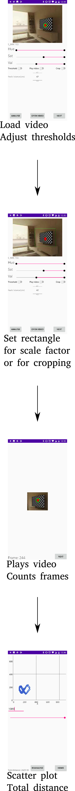

# javacv_tracking_android

IMPORTANT: Works only with small video files (~70MB). Try using files in sample_videos folder to test.
# Installation

* Open this page in your android browser, download the apk in javacv_tracking_android/app/release/ on to your device and follow instructions
* Download sample files
* Consider running with `Play video` setting to off for faster processing, and turn it on only if you suspect from your resultant graph that the thresholding is incorrect.

# Devices tested

* Nexus 5 (very slow, but works, with large files ~ 75 MB; works faster with smaller files)
* Nexus 5X (emulated)
* OnePlus 5T
* Pixel 2 (emulated)

# Usage instructions

